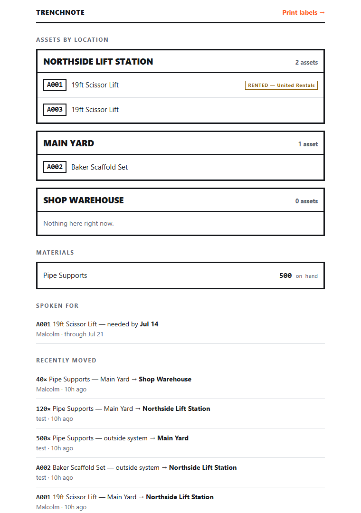

# TrenchNote

**A minimalist, self-hostable ledger for tracking equipment and materials
across construction job sites.**

Tape a QR code to a scissor lift. Anyone who scans it with their phone camera
sees what it is, where it's supposed to be, and how long it's been there — and
can log a move in two taps. No app to install, no account for field crews, no
vendor integrations.

TrenchNote answers three questions and refuses to be anything else:

1. **What is this thing?**
2. **Where is it?**
3. **Who moved it?**



It is not an ERP, not a Procore replacement, and not accounting software. It's
a field-logistics ledger built by a project engineer at a water/wastewater
general contractor, for the real problems of shared-equipment divisions:
internal tools bartered between sites, materials vanishing from staging yards,
and rented gear nobody remembers is still on rent.

## Design principles

- **Works on a cheap smartphone on a dirt lot with bad reception — or none.**
  Pages are measured in kilobytes, high contrast for direct sunlight, tap
  targets sized for gloved hands. Offline-first: the app opens with zero
  connectivity, shows the last-known data (clearly marked as old), and moves
  logged offline queue on the phone and sync themselves when signal returns.
- **No build step.** Plain HTML + CSS + Alpine.js, served straight from disk.
  All JavaScript is vendored into the repo — zero CDN or external requests at
  runtime.
- **Trivially self-hostable.** The entire backend is
  [PocketBase](https://pocketbase.io): one Go binary with an embedded SQLite
  database. A $5 VPS or a Raspberry Pi in a job trailer is enough.

## Quickstart

You need `git`, `curl`, and `unzip` (all standard on Linux/macOS; on Windows,
use Git Bash).

```sh
git clone https://github.com/mds08011/trenchnote.git
cd trenchnote
./scripts/setup.sh     # downloads the PocketBase binary for your OS
./pocketbase serve
```

On first start, PocketBase applies the schema from `pb_migrations/`
automatically — no manual database setup.

Then:

1. Open **http://127.0.0.1:8090/_/** and create your admin account.
2. Still in the admin UI, create the app logins in the **users** collection:
   one shared "field" account for crews, personal ones for managers. (There
   is no public sign-up, on purpose.)
3. Add a few `locations` (e.g. "Main Yard", "Northside LS"), a couple of
   `items` (what a thing *is* — "19' Scissor Lift"), and `assets` (a
   specific physical one, with a short `tag_code` like `A001`).
4. Open **http://127.0.0.1:8090/labels.html**, sign in, print the QR labels,
   and tape them on.
5. Scan a label with your phone camera → sign in once on that phone → the
   asset page opens in the browser → tap **Move** when the thing changes
   sites.
6. Already in the app? **📷 Scan** opens an in-app scanner — and picking
   your location turns it into an inventory walk that flags anything the
   ledger has wrong, with a one-tap fix.

Bulk materials (pipe supports, fittings — items with `tracking_mode=bulk`)
have no individual tags: open them from the dashboard's **Materials** section
to log deliveries and moves as quantities. Stock per location is always
derived from the movement ledger, never stored. Material that gets installed
doesn't vanish from history — log it as **Used / consumed** (it leaves stock
but stays in the ledger, with a note for the PO or where it went), so vendor
disputes stay winnable.

Need a machine for an upcoming pour? Any asset page has a **Reserve** option;
the claim shows up as a "spoken for" warning to anyone who scans that asset,
and on the dashboard.

### Testing from a phone

Your phone can't reach `127.0.0.1` — that's your computer's loopback. Serve on
your LAN IP instead:

```sh
./pocketbase serve --http=0.0.0.0:8090
```

Then set the **Base URL** on the labels page to `http://<your-lan-ip>:8090`
before printing, so the QR codes point somewhere phones can actually reach.

## Documentation

- **[USER_GUIDE.md](USER_GUIDE.md)** — the field guide: scanning, moving,
  reserving, materials. Written for crews, not developers.
- **[docs/DEVELOPER_GUIDE.md](docs/DEVELOPER_GUIDE.md)** — how it works under
  the hood: data model, the ledger invariants, migrations, frontend patterns.
- **[docs/DEPLOY.md](docs/DEPLOY.md)** — running it for real: trailer
  Pi or VPS, systemd, HTTPS with Caddy, and backups you've actually tested.
- **[docs/adr/](docs/adr)** — architecture decision records: why a single
  binary + static pages, and why an append-only ledger.

## Security note

**Everything requires sign-in.** Every API rule is locked to authenticated
users; there is no public self-registration (accounts are created by the
admin); the movements ledger can't be edited or deleted even by signed-in
users. Field crews sign in once per phone with a shared account and the
session renews itself on use.

For internet-facing deployments, put HTTPS in front (two lines of Caddy
config — see [docs/DEPLOY.md](docs/DEPLOY.md)) and use strong passwords on
the admin and user accounts. That's the whole checklist.

## License

[AGPLv3](LICENSE). Self-host it, modify it, run it for your company or NGO
freely. If you offer a modified TrenchNote to others over a network, you must
publish your modifications — that's the point.
