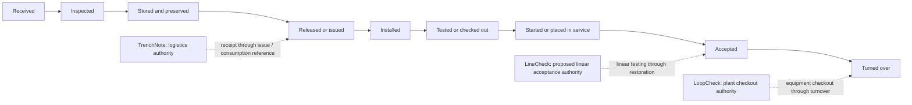

# Construction lifecycle map

**Authority:** Descriptive for current product behavior; proposed for future
cross-product ownership and handoffs

**Reviewed:** 2026-07-12

The product family follows one physical lifecycle without becoming one shared
application. Each application remains independently useful, deployable, and
authoritative for its bounded context.

## Lifecycle at a glance

The dotted lines show bounded ownership, not a shared workflow engine. A stage
may contain facts from more than one application without giving either
application authority over the other's facts.

## Stage ownership and evidence

| Lifecycle stage | CURRENT behavior | PROPOSED primary owner | Evidence produced | Authoritative fact remains with |
| --- | --- | --- | --- | --- |
| Material/equipment received | TrenchNote records bulk receipts and receiving evidence; unique assets can first appear through an asset move | TrenchNote | Movement timestamp, quantity/asset, destination, mover text, vendor/PO text, packing slip, OS&D note, photos | TrenchNote movement ledger |
| Inspected on receipt or while stored | TrenchNote can record asset inspection observations; LoopCheck has technical checkout concepts | TrenchNote for logistics/safety visibility; receiving product for technical acceptance | Inspection result, date, note, photo, requirement reference | The application that performed the observation; no implicit equivalence |
| Stored and preserved | TrenchNote records location/custody; explicit preservation log is not implemented here | TrenchNote for location/custody; preservation procedure owner remains open | Movement/location history; optional inspection/readings | TrenchNote for logistics facts |
| Released or issued | TrenchNote records transfer, reservation fulfillment, or consumption | TrenchNote | Movement, requester/fulfillment state, note | TrenchNote |
| Installed | TrenchNote can record consumption or transfer to an installed pseudo-location, but not installation acceptance | LineCheck for linear work; LoopCheck for plant equipment | Logistics reference from TrenchNote; installation/check record in receiving product | TrenchNote for material movement; receiving product for installation fact |
| Tested or checked out | Not a TrenchNote workflow; LineCheck is pre-alpha and LoopCheck implements plant checkout | LineCheck for linear tests; LoopCheck for plant checks | Test/check readings, method, evidence, punch/exception records | Testing/checking application |
| Started or placed in service | Not a TrenchNote workflow; LoopCheck owns plant startup concepts; service cutover currently exists in LoopCheck | LoopCheck for plant startup; LineCheck proposed for linear service cutover | Startup/functional test or service-cutover facts | Owning acceptance application |
| Accepted | Not a TrenchNote workflow | LineCheck for linear acceptance; LoopCheck for plant/system acceptance | Acceptance state, signatures/snapshots when implemented and approved | Owning acceptance application |
| Turned over | Not a TrenchNote workflow | LoopCheck for plant turnover; LineCheck for linear acceptance package as its design matures | Frozen package, signatures, report/export when implemented | Owning application; compiled paid deliverable is not source authority |

## Current application positions

### TrenchNote

**CURRENT:** authoritative through receipt, storage, custody, movement, issue,
and stock consumption. It may provide evidence or references downstream, but it
does not determine that work was installed correctly, tested, accepted, or
turned over.

### LineCheck

**CURRENT:** the locally reviewed repository is pre-alpha and contains a tested
domain/contracts slice rather than a complete field application.

**PROPOSED:** own linear-infrastructure acceptance: test segments, pressure
testing, flushing, disinfection, sampling, clearance for service, service
cutover, and restoration.

### LoopCheck

**CURRENT:** owns plant equipment/system checkout concepts and implements
service-cutover tracking as well as plant workflows. Locally reviewed
uncommitted work also means its signature/turnover state is unstable and should
not be documented here as settled.

**PROPOSED:** retain plant installation checkout, electrical/controls checks,
loop checks, startup, functional testing, training, and turnover. Its service
cutover feature is the principal current boundary overlap.

### Bindery sidecars

**DECIDED for TrenchNote; proposed family pattern:** optional paid products may
coordinate, aggregate, notify, host, compile, or integrate through public
interfaces. They are consumers, not the authority for field facts, and must not
be required for basic execution.

## Handoff points

No handoff below is implemented as a versioned TrenchNote contract today.
Every item is **PROPOSED**.

### Logistics to installation

Trigger candidate: a TrenchNote bulk consumption/installed transfer or asset
delivery identifies material/equipment available to the installing context.

Minimum handoff intent:

- source TrenchNote instance and contract version;
- stable source subject and movement references;
- human item/tag and job/location context;
- quantity and explicit unit when known;
- event/observation timestamps; and
- evidence references with provenance, not unaudited copies.

The receiving application decides whether to create a local installation
record. It must not mark installation accepted solely because logistics says
material was consumed.

### Installation to testing/checking

Trigger candidate: LineCheck or LoopCheck records installation readiness for a
segment, service, tag, or system. That application owns the readiness fact.
TrenchNote does not need to consume it to remain operational.

### Testing to service/startup

Trigger candidate: the authoritative acceptance application records required
test/check results. “Ready for service” must be derived or approved according to
that application's rules, not inferred from a TrenchNote movement.

### Acceptance to turnover

Trigger candidate: an acceptance application freezes or exports an accepted
record set. An optional paid compiler may assemble it, but must preserve source
identifiers, versions, evidence provenance, and immutable source facts.

## Overlap rules

1. The same physical object may appear in multiple products, but each product
   records a different domain fact.
2. A shared human code is not proof two records are the same object unless its
   namespace and scope are explicit.
3. Copying evidence does not transfer authority. Consumers retain source
   provenance and distinguish original from copy.
4. A lifecycle event announces a fact; it does not remotely command or approve
   another product's workflow.
5. Paid aggregation can summarize field systems but cannot become the only
   place the underlying field record can be retained or exported.

## Related documents

- [Product boundary](product-boundary.md)
- [Domain model](domain-model.md)
- [Proposed ecosystem contracts](ecosystem-contracts.md)
- [Overlap and migrations](overlap-and-migrations.md)
- [Open questions](open-questions.md)
